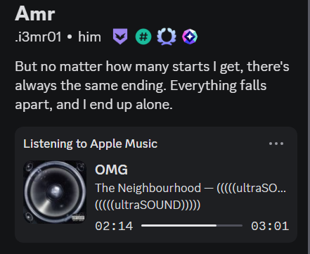

# 🎵 i3mr01 MusicRP

<div align="center">


**Advanced Discord Rich Presence for Apple Music with AI-Powered Features**

[](https://github.com/i3mr01/MusicRP/releases)
[](https://github.com/i3mr01/MusicRP/releases)
[](https://opensource.org/licenses/GPL-3.0)
[](https://dotnet.microsoft.com/download/dotnet/8.0)

</div>

## ✨ Overview

**i3mr0 MusicRP** is a cutting-edge Discord Rich Presence application that brings your Apple Music listening experience to Discord with advanced AI-powered features, intelligent analytics, and beautiful themes. Built from the ground up with modern .NET 8.0 and WPF, it offers a seamless integration between Apple Music and Discord.

### 🚀 Key Features

- **🎯 Smart Discord Integration**: Real-time Rich Presence with custom formats
- **🤖 AI-Powered Analytics**: Intelligent song analysis and recommendations
- **🎨 Beautiful Themes**: Dark, Light, Neon, and Minimal themes
- **📊 Performance Monitoring**: Real-time CPU, memory, and response tracking
- **📈 Listening Reports**: Detailed analytics and insights
- **🎵 Advanced Scrobbling**: Last.FM and ListenBrainz integration
- **⚡ Lightning Fast**: Optimized for performance and reliability

## 🛠️ Built With

- **.NET 8.0** - Modern, high-performance framework
- **WPF** - Beautiful, responsive user interface
- **Discord Rich Presence** - Seamless Discord integration
- **FlaUI** - Advanced UI automation for Apple Music
- **AI-Powered Features** - Smart analytics and recommendations
- **Theme System** - Customizable visual experience

## 🖼️ Screenshots

<div align="center">





</div>

## 📦 Installation

### Quick Start

1. **Download** the latest release from [GitHub Releases](https://github.com/i3mr01/MusicRP/releases)
2. **Extract** the files to a folder
3. **Important**: Windows SmartScreen may block the app - see [SmartScreen Bypass Guide](SMARTSCREEN_BYPASS.md)
4. **Run** `i3mr0-MusicRP.exe` or use `Run-i3mr0-MusicRP.bat` for easier startup
5. **Configure** settings through the system tray icon
6. **Enjoy** your music with Discord integration!

### System Requirements

- **Windows 10/11** (21H1 or later)
- **Apple Music** (Microsoft Store version)
- **Discord** (desktop app)
- **.NET 8.0 Desktop Runtime** (included in release)

## 🎮 Usage

### Basic Setup

1. **Launch** i3mr0 MusicRP
2. **Right-click** the system tray icon
3. **Click** "Settings" to configure
4. **Enable** Discord Rich Presence
5. **Start** playing music in Apple Music
6. **Watch** your status appear in Discord!

### Advanced Configuration

- **Custom Formats**: Create personalized subtitle formats
- **Theme Selection**: Choose from multiple beautiful themes
- **Scrobbling**: Connect Last.FM and ListenBrainz accounts
- **Performance**: Monitor real-time performance metrics
- **AI Features**: Enable smart recommendations and analytics

## 🎨 Features

### 🎯 Core Features
- **Real-time Rich Presence** for Apple Music
- **Custom subtitle formats** with placeholders
- **System tray integration** with context menu
- **Automatic startup** option
- **Update notifications** and version checking

### 🤖 AI-Powered Features
- **Smart song analysis** and categorization
- **Intelligent recommendations** based on listening history
- **Listening pattern analysis** and insights
- **Performance optimization** suggestions
- **Automated theme switching** based on time of day

### 🎨 Theme System
- **Dark Theme**: Elegant dark interface
- **Light Theme**: Clean, bright design
- **Neon Theme**: Vibrant, futuristic look
- **Minimal Theme**: Simple, distraction-free
- **Custom Themes**: Create your own themes

### 📊 Analytics & Monitoring
- **Real-time performance** monitoring
- **CPU and memory** usage tracking
- **Response time** analytics
- **Listening statistics** and reports
- **Performance alerts** and optimization tips

### 🎵 Music Integration
- **Apple Music** detection and tracking
- **Last.FM scrobbling** with authentication
- **ListenBrainz integration** for open-source scrobbling
- **Album art** and metadata extraction
- **Playlist tracking** and analysis

## 🔧 Development

### Building from Source

```bash
# Clone the repository
git clone https://github.com/i3mr01/MusicRP.git
cd MusicRP

# Restore dependencies
dotnet restore

# Build the solution
dotnet build --configuration Release

# Run the application
dotnet run --project i3mr0-MusicRP/i3mr0-MusicRP.csproj
```

### Project Structure

```
i3mr0-MusicRP/
├── i3mr0-MusicRP/          # Main application
│   ├── Resources/               # Icons and images
│   ├── Properties/              # Settings and resources
│   ├── *.cs                    # Core application files
│   └── *.xaml                  # UI definitions
├── .github/                     # GitHub Actions workflows
├── Documentation/               # Technical documentation
└── Tests/                      # Unit and integration tests
```

## 📚 Documentation

- **[Quick Start Guide](QUICKSTART.md)** - Get up and running in 5 minutes
- **[Feature Documentation](FEATURES.md)** - Complete feature list
- **[Technical Documentation](TECHNICAL_DOCS.md)** - Architecture and APIs
- **[Contributing Guide](CONTRIBUTING.md)** - How to contribute

## 🤝 Contributing

We welcome contributions! Please see our [Contributing Guide](CONTRIBUTING.md) for details.

### Development Setup

1. **Fork** the repository
2. **Clone** your fork
3. **Create** a feature branch
4. **Make** your changes
5. **Test** thoroughly
6. **Submit** a pull request

## 📄 License

This project is licensed under the **GPL-3.0 License** - see the [LICENSE](LICENSE) file for details.

## 🙏 Acknowledgments

- **Discord** for the Rich Presence API
- **Apple** for the amazing Apple Music platform
- **.NET Community** for excellent tools and libraries
- **Open Source Contributors** for inspiration and support

## 📞 Support

- **GitHub Issues**: [Report bugs and request features](https://github.com/i3mr01/MusicRP/issues)
- **Discussions**: [Community discussions](https://github.com/i3mr01/MusicRP/discussions)
- **Documentation**: [Full documentation](https://github.com/i3mr01/MusicRP/wiki)

## 🎯 Roadmap

- [ ] **Mobile Support** - iOS and Android apps
- [ ] **Spotify Integration** - Support for Spotify users
- [ ] **Advanced AI** - Machine learning recommendations
- [ ] **Plugin System** - Extensible architecture
- [ ] **Cloud Sync** - Settings and data synchronization

---

<div align="center">

**Made with ❤️ by [i3mr01](https://github.com/i3mr01)**

[⭐ Star this project](https://github.com/i3mr01/MusicRP) • [🐛 Report bugs](https://github.com/i3mr01/MusicRP/issues) • [💡 Request features](https://github.com/i3mr01/MusicRP/issues)

</div>
